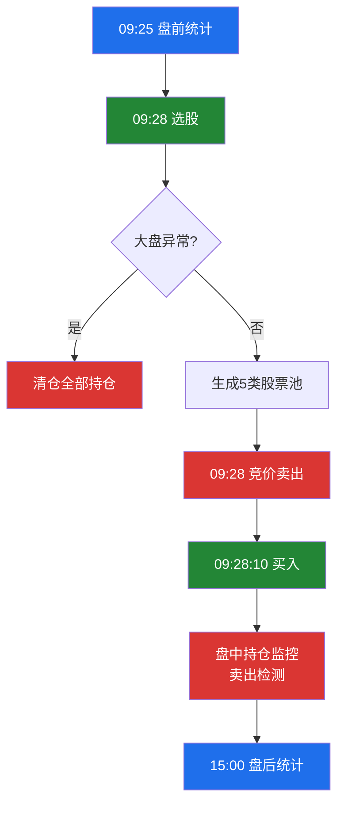
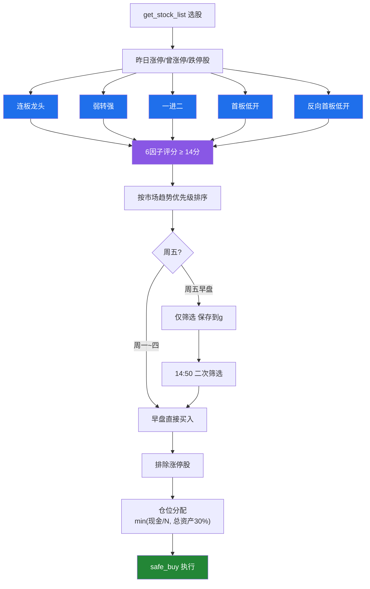
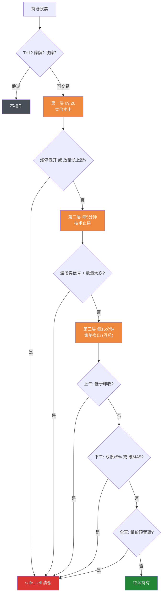

# Hot Stock 策略核心流程图

## 一、交易日主流程

```mermaid
graph TD
    A["09:25 盘前统计"] --> B["09:28 选股"]
    B --> C{"大盘异常?"}
    C -->|是| D["清仓全部持仓"]
    C -->|否| E["生成5类股票池"]
    E --> F["09:28 竞价卖出"]
    F --> G["09:28:10 买入"]
    G --> H["盘中持仓监控\n卖出检测"]
    H --> I["15:00 盘后统计"]

    style A fill:#1f6feb,color:#fff
    style B fill:#238636,color:#fff
    style D fill:#da3633,color:#fff
    style F fill:#da3633,color:#fff
    style G fill:#238636,color:#fff
    style H fill:#da3633,color:#fff
    style I fill:#1f6feb,color:#fff
```

---

## 二、选股与买入

```mermaid
graph TD
    A["get_stock_list 选股"] --> B["昨日涨停/曾涨停/跌停股"]
    B --> C1["连板龙头"]
    B --> C2["弱转强"]
    B --> C3["一进二"]
    B --> C4["首板低开"]
    B --> C5["反向首板低开"]

    C1 --> D["6因子评分 ≥ 14分"]
    C2 --> D
    C3 --> D
    C4 --> D
    C5 --> D

    D --> E["按市场趋势优先级排序"]
    E --> F{"周五?"}
    F -->|"周一~四"| G["早盘直接买入"]
    F -->|"周五早盘"| H["仅筛选 保存到g"]
    H --> I["14:50 二次筛选"]
    I --> G
    G --> J["排除涨停股"]
    J --> K["仓位分配\nmin(现金/N, 总资产30%)"]
    K --> L["safe_buy 执行"]

    style C1 fill:#1f6feb,color:#fff
    style C2 fill:#1f6feb,color:#fff
    style C3 fill:#1f6feb,color:#fff
    style C4 fill:#1f6feb,color:#fff
    style C5 fill:#1f6feb,color:#fff
    style D fill:#8957e5,color:#fff
    style L fill:#238636,color:#fff
```

---

## 三、卖出体系

```mermaid
graph TD
    A["持仓股票"] --> B{"T+1? 停牌? 跌停?"}
    B -->|跳过| SKIP["不操作"]
    B -->|可交易| C["第一层 09:28\n竞价卖出"]

    C --> C1{"涨停低开 或 放量长上影?"}
    C1 -->|是| SELL["safe_sell 清仓"]
    C1 -->|否| D["第二层 每5分钟\n技术止损"]

    D --> D1{"波段卖信号 + 放量大跌?"}
    D1 -->|是| SELL
    D1 -->|否| E["第三层 每15分钟\n策略卖出 (互斥)"]

    E --> E1{"上午: 低于昨收?"}
    E1 -->|是| SELL
    E1 -->|否| E2{"下午: 亏损≥5% 或 破MA5?"}
    E2 -->|是| SELL
    E2 -->|否| E3{"全天: 量价顶背离?"}
    E3 -->|是| SELL
    E3 -->|否| HOLD["继续持有"]

    style SELL fill:#da3633,color:#fff
    style SKIP fill:#484f58,color:#fff
    style HOLD fill:#238636,color:#fff
    style C fill:#f0883e,color:#fff
    style D fill:#f0883e,color:#fff
    style E fill:#f0883e,color:#fff
```
